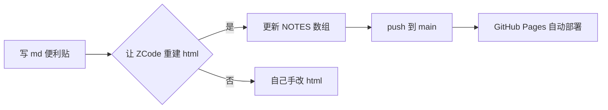

ASCII 连线图在等宽字体下勉强能看，但一旦换字体或缩放就错位、丑陋、不可读。改用 **Mermaid** 图表引擎：渲染出来是清晰的矢量图，可缩放、可右键保存成 SVG/PNG，GitHub / Markdown 都原生支持。

## 什么时候用
- 流程图、时序图、类图、状态机、甘特图
- 需要嵌入 Markdown 且希望 GitHub 直接渲染的场景

## 示例（GitHub / 大多数 Markdown 渲染器原生支持）
````markdown

````

## 我的技巧
- 复杂图先用 [mermaid.live](https://mermaid.live/) 调好再贴进 md
- 节点文字尽量短，连线方向用 `LR`/`TD` 控制
- 想要保存成图片：Live Editor 右上角 Actions → SVG/PNG

## 我的笔记
<!-- 记录你踩过的坑 -->
